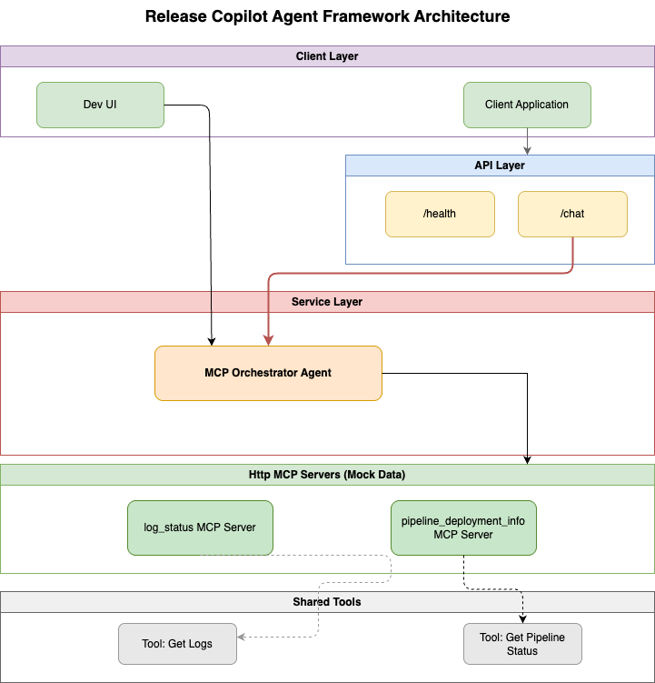

# Release Copilot Agent - CI/CD Assistant

This project demonstrates building AI agents with Microsoft Agent Framework in Python using **FastMCP** for tool integration.

The agent helps with CI/CD deployment queries, including pipeline status checks and log analysis.

## Architecture Overview

The system uses **FastMCP tools** with a single orchestrator agent:



```
User Query
    |
    v
MCP Orchestrator Agent
    |
    |-- Calls --> get_pipeline_status (FastMCP Tool)
    |                   |
    |                   |-- Reads --> data/pipelines.json
    |
    |-- Calls --> get_job_logs (FastMCP Tool)
                        |
                        |-- Reads --> data/log.json
```

**Benefits:**
- ✅ Simple architecture (single agent)
- ✅ Direct tool calls (fast performance)
- ✅ FastMCP protocol (can host as HTTP/SSE servers)
- ✅ Easy to test and maintain

**Key Files:**
- `src/rc_agent/agents/mcp_orchestrator.py` - Main orchestrator agent
- `src/rc_agent/mcp/pipeline_mcp_server.py` - Pipeline tool (FastMCP)
- `src/rc_agent/mcp/job_logs_mcp_server.py` - Logs tool (FastMCP)
- `examples/mcp_usage_example.py` - Usage examples

### Data Access

Tools read directly from JSON data files:
- `data/pipelines.json` - Pipeline status data
- `data/log.json` - Job execution logs

## Project Structure

```
release-copilot-agent/
├── .devcontainer/              # Dev container configuration
│   ├── devcontainer.json       # Container settings with Azure CLI
│   └── post_create.sh          # Auto-install Azure CLI
├── src/
│   └── rc_agent/
│       ├── agents/             # Agent implementations
│       │   └── mcp_orchestrator.py      # Main orchestrator with FastMCP tools
│       ├── mcp/                # FastMCP tool servers
│       │   ├── pipeline_mcp_server.py   # Pipeline status tool
│       │   └── job_logs_mcp_server.py   # Job logs tool
│       ├── services/           # Data access layer (legacy)
│       │   ├── pipeline_service.py
│       │   └── logs_service.py
│       ├── telemetry/          # OpenTelemetry tracing
│       │   └── otel.py
│       ├── config/             # Settings management
│       │   └── settings.py
│       └── app/                # Application entry points
│           ├── api.py          # FastAPI REST API
│           ├── cli_chat.py     # Interactive CLI (legacy multi-agent)
│           └── devui_entry.py  # AI Toolkit DevUI
├── data/                       # Sample data files
│   ├── pipelines.json          # Pipeline status data
│   └── log.json                # Job execution logs
├── examples/                   # Usage examples
│   ├── mcp_usage_example.py    # MCP orchestrator example
│   └── api_client_example.py   # API client example
├── traces/                     # OpenTelemetry trace files
├── run_mcp_servers.py          # Helper to run MCP servers as HTTP/SSE
├── test_mcp_http.py            # Test FastMCP tools
├── view_traces.py              # Trace viewer utility
├── pyproject.toml              # Python project & dependencies
├── Makefile                    # Common commands
└── .env                        # Environment variables (not in git)
```

## OpenTelemetry Tracing

The system includes comprehensive tracing that captures:
- Agent invocations (coordinator + specialists)
- LLM calls (chat completions)
- Tool executions
- Token usage statistics

Traces are automatically written to timestamped files in `traces/trace_YYYYMMDD_HHMMSS.jsonl`

View traces with:
```bash
python view_traces.py --summary  # Summary statistics
python view_traces.py            # Full trace details
```

## Getting Started

### Prerequisites

- **Docker** or **VS Code with Dev Containers extension**
- **Azure subscription** with access to Azure OpenAI
- **Git** for version control

### Step 1: Clone the Repository

```bash
git clone https://github.com/zoeyzuo-se/release-copilot-agent.git
cd release-copilot-agent
```

### Step 2: Set Up Azure Authentication

**On your HOST machine** (not in dev container):

```bash
az login
az account set --subscription "YOUR_SUBSCRIPTION_NAME"
```

> **Why on host?** The dev container mounts your `~/.azure` credentials from the host to bypass device compliance policies.

### Step 3: Configure Environment Variables

Create a `.env` file in the project root:

```bash
cp .env.example .env
```

Edit `.env` with your Azure OpenAI details:

```env
AZURE_OPENAI_ENDPOINT=https://your-resource.openai.azure.com/
AZURE_OPENAI_DEPLOYMENT=gpt-4o-mini
```

### Step 4: Open in Dev Container

1. Open the project in **VS Code**
2. Press `F1` → **Dev Containers: Reopen in Container**
3. Wait for the container to build and post-create script to run

The dev container includes:
- Python 3.13
- `uv` package manager
- Azure CLI (auto-installed)
- Node.js LTS
- VS Code extensions (Pylance, Ruff, Black, mypy)

### Step 5: Install Dependencies

Inside the dev container:

```bash
make install
```

This runs:
- `uv sync` - Syncs dependencies from `pyproject.toml`
- `uv pip install -e .` - Installs the package in editable mode

## Running the Application

### Option 1: FastAPI REST API (Recommended for Integration)

Start the API server:

```bash
make api
# API will be available at http://localhost:8000
# Docs at http://localhost:8000/docs
```

Use the API client:

```bash
```bash
make api-client
# or
python examples/api_client_example.py
```

### Option 2: MCP Orchestrator (Direct Usage)
Run the MCP-based orchestrator example:

```bash
python examples/mcp_usage_example.py
```

Or use it in your own code:

```python
from rc_agent.agents.mcp_orchestrator import create_mcp_orchestrator
```python
from rc_agent.agents.mcp_orchestrator import create_mcp_orchestrator

agent = create_mcp_orchestrator()
result = await agent.run("What's the status of payments in prod?")
```

### Option 3: Development UI (AI Toolkit)interactive agent testing:

```bash
make devui
```

This starts the AI Toolkit UI where you can:
- Test the multi-agent workflow interactively
- View real-time agent conversations
- Inspect tool calls and LLM responses
- Debug agent behavior with visual feedback

### Option 4: FastMCP HTTP/SSE Servers (Optional)

Run FastMCP tools as remote HTTP/SSE servers:

```bash
| **FastAPI** | REST API framework for programmatic access |
| **Uvicorn** | ASGI server for the API |
| **uv** | Fast Python package manager (replaces pip) |
| **Microsoft Agent Framework** | Build AI agents with function calling |
| **FastMCP** | Fast Model Context Protocol for tool integration |
| **Azure OpenAI** | LLM backend with DefaultAzureCredential |
| **python-dotenv** | Load environment variables from `.env` |
| **Pydantic** | Type validation for function parameters |protocol.


## Key Technologies

| Technology | Purpose |
|------------|---------|
| **FastAPI** | REST API framework for programmatic access |
| **Uvicorn** | ASGI server for the API |
| **uv** | Fast Python package manager (replaces pip) |
| **Microsoft Agent Framework** | Build AI agents with function calling |
| **MCP (Model Context Protocol)** | Standard protocol for AI tool integration |
| **Azure OpenAI** | LLM backend with DefaultAzureCredential |
| **python-dotenv** | Load environment variables from `.env` |
| **Pydantic** | Type validation for function parameters |
This starts the AI Toolkit UI where you can:
- Test the agent interactively
- View real-time conversations
- Inspect tool calls and LLM responses
- Debug agent behavior with visual feedback

# Run MCP orchestrator example
python examples/mcp_usage_example.py

# Launch AI Toolkit development UI
make devui

# Run FastMCP servers as HTTP/SSE (optional)
make mcp-servers

# Test FastMCP tools
python test_mcp_http.py

# Test MCP servers independently
python src/rc_agent/mcp/pipeline_mcp_server.py
python src/rc_agent/mcp/job_logs_mcp_server.py

# View traces
python view_traces.py --summary

# Clean up cache files
make clean
```

## How It Worksting

The coordinator analyzes user queries and routes them:

**Pipeline Status Queries** → Pipeline Status Agent
- "What is the status of X service?"
- "Is the deployment to production complete?"
- "Show me the pipeline for Y environment"

**Log Analysis Queries** → Job Logs Analyzer Agent
- "Why did job-789 fail?"
- "Analyze the logs for this job"
- "What went wrong with the deployment?"

### 3. Data Flow

```
User Query
    ↓
Coordinator Agent (decides which specialist)
    ↓
Specialist Agent (processes query)
    ↓
Tool Function (data access)
    ↓
Service Layer (reads JSON data)
    ↓
Returns formatted response
    ↓
Coordinator presents to user
```

## Development Notes

### Adding New Specialist Agents

1. Create agent in `src/rc_agent/agents/`
2. Implement with specialized instructions and tools
3. Add service layer if needed in `src/rc_agent/services/`
4. Wrap in `@ai_function` in orchestrator
5. Add to coordinator's tool list
6. Update coordinator instructions

### Tracing Configuration

Tracing is initialized in `src/rc_agent/telemetry/otel.py`:
- Automatic timestamped trace files
- Console metrics suppressed for clean CLI output
- Integrates with Agent Framework's observability

### Environment Variables

Required in `.env`:
```env
AZURE_OPENAI_ENDPOINT=https://your-resource.openai.azure.com/
AZURE_OPENAI_DEPLOYMENT=gpt-4o-mini
```

Authentication uses `DefaultAzureCredential` from Azure Identity, which supports:
- Azure CLI credentials (recommended for local dev)
- Managed Identity (for production)
- Environment variables
- Interactive browser authentication

## Best Practices Demonstrated

1. **Separation of Concerns**: Agents, services, and data access are clearly separated
2. **Multi-Agent Orchestration**: Coordinator pattern with specialist delegation
3. **Observability**: Comprehensive OpenTelemetry tracing
4. **Type Safety**: Pydantic models and type hints throughout
## How It Works

The orchestrator agent uses two FastMCP tools:

1. **get_pipeline_status** - Checks deployment pipeline status
   - Reads from `data/pipelines.json`
   - Returns status, pipeline_id, branch, timestamps, and failed_job_id

2. **get_job_logs** - Retrieves execution logs
   - Reads from `data/log.json`
   - Returns detailed log lines for analysis

### Agent Workflow

```
User Query
    ↓
Orchestrator analyzes intent
## Development Notes

### FastMCP Tools

Each tool has two modes:

1. **Direct function call** (default) - Fast, in-process
   ```python
   from rc_agent.mcp.pipeline_mcp_server import get_pipeline_status
   result = get_pipeline_status(service="payments", environment="prod")
   ```

2. **HTTP/SSE server** (optional) - For remote deployment
   ```bash
   python src/rc_agent/mcp/pipeline_mcp_server.py  # Runs on port 8001
   ```

### Adding New Tools

1. Create tool function in `src/rc_agent/mcp/`
2. Use `@mcp.tool()` decorator for HTTP/SSE hosting
3. Export plain function for direct imports
4. Add to orchestrator's tools list

### Tracing Configuration

Tracing is initialized in `src/rc_agent/telemetry/otel.py`:
- Automatic timestamped trace files in `traces/`
- Captures agent invocations, tool calls, and LLM requests
- View with `python view_traces.py --summary`

### Environment Variables

Required in `.env`:
```env
AZURE_OPENAI_ENDPOINT=https://your-resource.openai.azure.com/
AZURE_OPENAI_DEPLOYMENT=gpt-4o-mini
```

Authentication uses `DefaultAzureCredential` from Azure Identity, which supports:
- Azure CLI credentials (recommended for local dev)
- Managed Identity (for production)
- Environment variables
- Interactive browser authentication

## Best Practices Demonstrated

1. **FastMCP Integration**: Clean tool definitions with dual-mode support (in-process + HTTP/SSE)
2. **Type Safety**: Pydantic models and type hints throughout
3. **Observability**: Comprehensive OpenTelemetry tracing
4. **Clean Architecture**: Separation of tools, agents, and configuration
5. **Development Workflow**: Dev containers for consistent environments
6. **Flexibility**: Tools can run in-process or as remote services